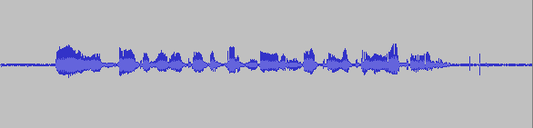

# Record your data
You will now start recording the sentences you have selected in assignment 4. We will be using our own recording client, `sLOBE` to carry out the recording sessions.

## Setting up your own recording studio
There is a good [document on speech.zone](http://www.speech.zone/exercises/build-a-unit-selection-voice/make-the-recordings/) about carrying out your own recording sessions. Most importantly:
* Try to use a headphone microphone if you have access to one (or a proper microphone if you have one)
* Manage your levels. Before starting a recording session, open up audacity and record a sample sentence. You can then play back the recording and audacity will show the playback level in the tool bar. We want to try to keep this value as stable as possible across sessions. Try to aim for a value betwfeen -18 and -9 dB.
    * You can change the input volume of your microphone through your operating system. We want the input volume to be high (hot) but never "hit the red" which would result in clipping. Changing the input volume such that recording your natural voice results in levels bouncing between -18 and -9 should suffice.
    * The image below shows a waveform for a speech recording. Your tests should reach amplitudes of at least this scale.
* Try to speak as uniformly as possible across all sentences and avoid animated speech.
* Ensure chair, microphone, etc. are positioned the same way in every session.
* When you are speaking, ensure that you are not fidgeting, playing with any of the cables, your hair, etc.



**Before you start using sLOBE, send me a sample recording exported from Audacity.**

## Using SLOBE
LOBE is a recording client that the LVL has created to facilitate recording sessions for TTS data acquisition. We have created a special client for you named SLOBE. The client is available [here](https://eyra.ru.is/slobe/). You will need to login using the credentials that I have sent you via Microsoft Teams.
* The [collection screen](https://eyra.ru.is/slobe/collections/) shows all collections in SLOBE. You will be using the collection with the same name as your student ID.
* To add the sentences you will read:
    * click your collection
    * click the orange "breyta" button
    * click the "bæta við setningum" dropdown button.
    * In the modal that appears, make sure to set "G2P skjal" to on.
    * Find the reading list you generated in assignemnt 4 on your file system and press the blue "klára" button.
* To start recording your sentences:
    * again click your collection from the collection screen.
    * click the green "taka upp" button
    * A modal will appear that asks you to confirm that you are in fact you. We do this to reduce the risk of people accedentally recording in some other collections.
* Other notes:
    * The following keyboard shortcuts can come in handy while recording:
        * arrow-up: Start recording / Stop recording
        * arrow-down: Play the recording
        * arrow-right: Go to next sentence
        * arrow-left: Go to previous sentence
    * You can "skip" specific sentences by clicking the red "Sleppa" button. You should only do this if you think the sentence is incorrect in any way.
    * After capturing a recording, the corresponding waveform should appear below the prompt. You can use this to create time stamps that correspond to the start of your utterance and the end of your utterance:
        * Click and drag on the waveform to start to select the area of the waveform you want to mark. The selected area will by highlighted in orange.
        * Once you have made the selection you can play back the selection to confirm you haven't cut out too much. Note: you only want to cut out exessive silence periods or noise if possible. It is okay to pad the selection with about 0.5-1 second of silence at both ends.
        * Once you have confirmed your selection you can press the "klippa" button to save your selection. Note: this is a non-destructive operation so even if you have made a bad selection, the original audio capture will persist in the system.

## Recording Your Voice
* In our experiments, each 50 sentence session takes about 10 minutes to finish. This means that you could finish recording your list of 500 sentences in two 50 minute sessions. We recommend you do this across two days to avoid any strain.
* When you have finished your reading list you can export the dataset from LOBE.

## Downloading Your Data
After recording all your sentences, it is time to download the data.
1. Go to the main page for your collection on sLOBE
2. Click the `sækja` button with the download icon.
3. A modal window will appear. When you are downloading the dataset for the first time you first have to generate the archive. Click the `Gera skjalasafn` button.
4. The process to generate the zip can take a couple of minutes. When it is ready it will appear in the list of zip archives on sLOBE.
5. Go to the list of all collections.
6. Click the `Skjalasöfn` button.
7. Find your collection in the list
8. Click the green download icon left to the name of your collection.
9. The `.zip` file will now start streaming to your machine

## The Archive and Post Processing
An example archive is at `./data/example_archive`. The structure of the archive is as follows
```
audio/
    <speaker_id>/
        wav_id_1.wav
        wav_id_2.wav
        ...
text/
    text_id_1.token
    text_id_2.token
    ...
index.tsv
info.json
meta.json
```
where:
* `index.tsv`: Contains the mapping from text to waveforms
* `meta.json`: Contains general information about the collection
* `info.json`: Contains detailed information about each recording:
    * Each item in this dictionary is identified by the sLOBE id of the recording
    * `info[recording_id]['recording_info]['start']` and `info[recording_id]['recording_info]['stop']` are float value time stamps you can use to trim your recordings if you have used the trim functionality in sLOBE.

After downloading your data you should trim the recordings:
* To avoid completely destroying the archive you should first create a copy of the archive on your hard drive.
* Use prior knowledge from previous assignments to trim the recordings using the `start` and `stop` values in `info.json` and replace each recording in your archive with the trimmed version. Note: To achieve this, you should create a function `time_to_samples(time_stamp, sr)`. It should convert a float value time stamp to the corresponding sample index, given the sample rate.
* Take a look at `example.py` to understand how to traverse the archive and perform OS operations using Python.

## What to Turn In
* A short document that includes:
    * Details about your recording environment, such as choice of microphone, how you maintained the same position relative to mic across sessions etc. A photo of your recording environment is also beneficial.
    * A list of the recording sessions and the duration of them (TODO: add information about how to do this in LOBE)
    * We will monitor your progress on LOBE and you don't need to send us your datasets.
    * The dataset export includes a detailed information file, `info.json`. Each item in that file has a `text_info` and a `recording_info` dictionary.
        * Using `item['text_info']['text]` as well as `item['recording_info']['duration']` calculate the average string length of your text data and the average recording duration. Plot a scatter plot for each recording item where string length is on the x-axis and recording duration is on the y-axis.

# Alternative assignment for foreign students
We are very understanding of the fact that some of you have limited knowledge of Icelandic and would likely prefer to complete the assignment in your own language. Unfortunately we cannot facilitate the work that is required to prepare TTS models for multiple languages since we only have access to Icelandic data. Therefore we have prepared an alternative assignment for you that doesn't require you to speak Icelandic.

Instead of recording your own data you will be using a pre-recorded Icelandic TTS dataset, available [here](https://drive.google.com/open?id=13KSAX6tXS5DyaA1Hl6pLMd0XVDnub2vS).

Your task is the following:
1. The script `create_corpus.py` in the archive creates a tab-seperated file similar to list.tsv in the data directory of assignment 4. You have to create a new reading list like you did in assignment 4 using this new source of text.
2. Run your reading list generation script from assignment 4 again on this file. Note that this time the file has this scheme: `recording_id`\t`sentence`\t`pronounciation` so you need to change the `read_list` and `save_list` from `tools.py` in assignment 4 to account for this
3. You don't have to save your new reading list in the format mentioned in assignment 4, you only need to capture the coverage of this list and make a similar report as in assignment 4. You **have** to store the IDs of the recordings you have selected to continue.
4. Store the IDs of your selected recordings somewhere safe. You will use these IDs to create your TTS training dataset. You can read more about what each of the files contain in the `README` and `example.py` under assignment 5.
5. Using these IDs you should create a new dataset just like the one you are working with that only references your selected recordings:
    * it should contain the directories `audio` and `text` with just your sentences and recordings
    * you should change `info.json` and `index.tsv` to only contain references to your recordings.
    * You should also include the `meta.json` but you shouldn't have to change that file at all.
6. Since you will not be recording the data in sLOBE you will have to remove silence periods from the start and end of the recordings you have selected.
    * You will use [`librosa.effects.trim`](https://librosa.github.io/librosa/generated/librosa.effects.trim.html?highlight=trim#librosa.effects.trim).
    * Test out different values of top_db to determine a value that will cut out starting and ending silences but doesn't cut off any part of the speech waveform. You can both listen to the trimmed version and compare waveform plots to monitor this. Start with top_db=60.
    * Once you think you have a suitable value, you should generate a plot for three different samples:
        * first plot the untrimmed waveform
        * then plot two vertical lines that denote where you trim the waveform by using the index returned by `librosa.effects.trim()`

## What to turn in
You should turn in
* the `info.json` file
* the three plots I mentioned earlier
* information about your trimming strategy
* The same information about coverage of your new reading list as in assignment 4
* The dataset export includes a detailed information file, `info.json`. Each item in that file has a `text_info` and a `recording_info` dictionary.
    * Using `item['text_info']['text]` as well as `item['recording_info']['duration']` calculate the average string length of your text data and the average recording duration. Plot a scatter plot for each recording item where string length is on the x-axis and recording duration is on the y-axis.