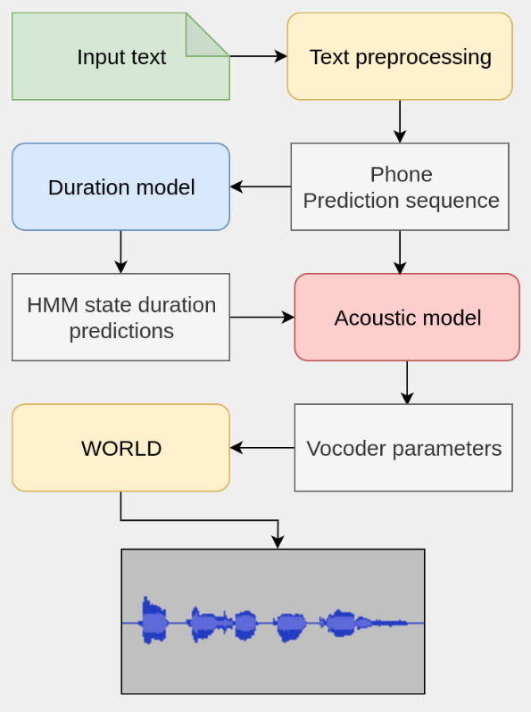

# Run an SPSS in the cloud using AWS
The repository for Ossian is [here](https://github.com/CSTR-Edinburgh/Ossian) and Merlin [here](https://github.com/CSTR-Edinburgh/merlin). Since these systems are quite complicated and computationally heavy we will be using AWS virtual machines to train the models in the background.

# About the Icelandic Ossian Recipe.
The naive Icelandic recipe that you will be using consists of the following modules:
* Front-end:
    * Tokenizer: Splits sentences into *tokens*. The recipe offers both a specific Icelandic tokenizer and a more simple regular expression tokenizer. We will use the regex tokenizer that basically splits the sentence on white space.
    * The tokens are then phonetized using an Icelandic lexicon. A G2P model handles out-of-vocabulary entries. This is the same G2P model you perhaps used in assignment 4.
    * [Vector Space Models (VSMs)](https://en.wikipedia.org/wiki/Vector_space_model) are trained on the token level to simulate a part-of-speech tagger. In short, the VSMs define categories of words based on the context in which they appear.
    * Acoustic features are then extracted from the waveforms. We will use the WORLD vocoder for synthesis and the features needed are:
        * Log F0s
        * 60-dimensional Mel generalized cepstral coefficients (MGCs)
        * 1-dimensional band aperiodic parameter (BAP)
        * deltas and delta-deltas of all three features
* Alignment:
    * The acoustic features are aligned with phones using HMM alignment via the Viterbi maximum-likelihood algorithm
    * Using that alignment, a pause prediction decision tree is trained.
    * Next, tokens are regrouped into ’phrases’ which are delimited by silence.  This is useful at synthesis time as phrases can be synthesized independently and in parallel.
* Duration model:
    *  takes a phone sequence with VSM representations as input
    * outputs durations for each HMM state of each phone in the sequence.
    * This is a fully connected feed-forward neural network with 3 512-dimensional hidden layers with tanh activation
* Acoustic model:
    * takes a phone sequence with state durations and VSM representations as input
    * outputs a sequence of vocoder feature frames.
    * This is also fully connected feed-forward neural network, but with 6 1024-dimensional hidden layers with tanh activation

The process at synthesis time is as follows:
1. Text preprocessing is applied to text (i.e. tokenization, phonetization and VSM tagging)
2. The resulting phone sequence is forward-passed through the duration and acoustic models to obtain vocoder features
3. These features are then passed to the WORLD vocoder to produce a speech waveform



# Setting up AWS
1. Create a free tier account [here](https://aws.amazon.com/). Note you will have to input credit card information. Don't worry about being charged since you will select the free tier account which gives you 750 compute hours for free for 12 months. When this course has finished you can delete your AWS account without any charges being made. If you want to be extra secure, visit the [billing preference page](https://console.aws.amazon.com/billing/home?#/preferences) and select to receive free tier usage alerts.
2. Sign in to the AWS console
3. Select `Launch a virtual machine` under the `Build a solution` row.
4. Select the `Ubuntu Server 18.04 LTS (HVM), SSD Volume Type` 64-bit (x86) variant.
5. Select the `t2.micro` instance type, press `review and launch` and then `launch`
6. When prompted, choose `reate a new key pair`, select any name and press `download key pair`. Move the key to some location where you are unlikely to delete it. Modify permissions (giving you sole read access) with e.g. `chmod 400 <key_name>.pem` on Linux.

# Connecting to the virtual machine
We will be using SSH to connect to the machine remotely. Make sure that your machine has an SSH client, otherwise install one. The following guide is a shorter version of this [AWS guide](https://docs.aws.amazon.com/AWSEC2/latest/UserGuide/AccessingInstancesLinux.html).
1. Find the public DNS of your instance by going to the AWS console > select services > select EC2 > click instances. The instance public DNS is located in the table under `Public DNS (IPv4)`.
2. Then run `ssh -i /path/to/key.pem ubuntu@<your_public_dns>`
3. Type in `yes` when prompted
You have now successfully `ssh`ed into the instance.

**Using VS Code**:
One of the great benefits of using VS code over SSH is you can use a fully fletched text editor directly on the remote machine. Transferring data over SSH can also be quite cumbersome. Using VS code you can simply drag and drop the files over to the remote machine.

* Make sure you have installed the `Remote - SSH` extension in VS Code (search for `ms-vscode-remote.remote-ssh`)
* Click the blue connect button in the bottom left corner of VS code (or press `ctrl`+`shift`+`p` and enter "ssh" and click the option `Remote-SSH: Connect to Host...`)
* Select the `Add new SSH Host...` when prompted
* Enter in the same call as you did in step 2 above, i.e. `ssh -i /path/to/key.pem ubuntu@<your_public_dns>`.
* You have to update an SSH configuration file to continue. You should have an option to edit e.g. `/home/<your_user>/.ssh/config` if on Linux or similar on other OSs. Select that one and continue.
* Now you can connect to the machine by:
    * again clicking the blue connect icon in the bottom left corner.
    * Select `Connect to host...`
    * Select your amazon EC2 host.

# Setup the necessary tools for Ossian (*on the VM*)
1. Update `apt`: `sudo apt-get update`
2. Install Python : `sudo apt-get install python`
3. Install pip:
    * run `curl -O https://bootstrap.pypa.io/get-pip.py`
    * run `python get-pip.py --user`
    * run `export PATH=$PATH:~/.local/bin`
    * Verify pip installation : `pip --version`
4. Install other system packages:
    * `sudo apt-get install python2.7-dev swig build-essential autoconf libtool pkg-config python-opengl  python-pyrex python-pyside.qtopengl idle-python2.7 qt4-dev-tools qt4-designer libqtgui4 libqtcore4 libqt4-xml libqt4-test libqt4-script libqt4-network libqt4-dbus python-qt4 python-qt4-gl libgle3 python-dev sox`
5. Install Python requirements:
    * `pip install numpy==1.16.6 --user`
    * `pip install scipy configobj scikit-learn regex lxml argparse bandmat theano matplotlib soundfile tokenizer==1.4.1 --user`
    * `pip install git+https://github.com/sequitur-g2p/sequitur-g2p@master`
6. Clone the Ossian repository: `git clone -b rvk2019 https://github.com/CSTR-Edinburgh/Ossian.git`
7. Setup Ossian tools:
    * Create HTK credentials [http://htk.eng.cam.ac.uk/register.shtml](here) and then run:
        * `export HTK_USERNAME=<your_htk_username>`
        * `export HTK_PASSWORD=<your_htk_password>`
    * Run `cd Ossian`
    * Run `export OSSIAN=$PWD` (Note: you will have to perform this step each time you start a new session.)
    * Run `./scripts/setup_tools.sh $HTK_USERNAME $HTK_PASSWORD`
8. Verify that everything is working by running a toy example in romanian:
    * Get the data:
        * `cd $OSSIAN`
        * `wget https://www.dropbox.com/s/uaz1ue2dked8fan/romanian_toy_demo_corpus_for_ossian.tar?dl=0`
        * `tar xvf romanian_toy_demo_corpus_for_ossian.tar\?dl\=0`
    * Prepare the acoustic and duration models using Ossian: `python ./scripts/train.py -s rss_toy_demo -l rm naive_01_nn`
    * Train the duration model on CPU using Merlin: `export THEANO_FLAGS=""; python ./tools/merlin/src/run_merlin.py $OSSIAN/train/rm/speakers/rss_toy_demo/naive_01_nn/processors/duration_predictor/config.cfg`
    * Train the acoustic model on CPU using Merlin: `export THEANO_FLAGS=""; python ./tools/merlin/src/run_merlin.py $OSSIAN/train/rm/speakers/rss_toy_demo/naive_01_nn/processors/acoustic_predictor/config.cfg`
    * Convert the Merlin models to Ossian models:
        * `python ./scripts/util/store_merlin_model.py $OSSIAN/train/rm/speakers/rss_toy_demo/naive_01_nn/processors/duration_predictor/config.cfg $OSSIAN/voices/rm/rss_toy_demo/naive_01_nn/processors/duration_predictor`
        * `python ./scripts/util/store_merlin_model.py $OSSIAN/train/rm/speakers/rss_toy_demo/naive_01_nn/processors/acoustic_predictor/config.cfg $OSSIAN/voices/rm/rss_toy_demo/naive_01_nn/processors/acoustic_predictor`
    * These steps take some time to finish and a lot of stuff should have been printed to the shell as a result. If everything is OK you should now be able to synthesize speech in Romanian. To do this:
        * run `mkdir $OSSIAN/test/wav/`: This is where your synthesized output will be located
        * run `python ./scripts/speak.py -l rm -s rss_toy_demo -o ./test/wav/romanian_toy_HTS.wav naive_01_nn ./test/txt/romanian.txt`
        * Then copy the output via ssh to your machine: `scp -i ossian.pem ubuntu@<your_public_dns>:/home/ubuntu/Ossian/test/wav/romanian_toy_HTS.wav .` (**Note**: If you are using VS code you can simply right click the file in the explorer and choose `download`)
        * You can now play the synthesized output on your machine

# Adding the naive Icelandic recipe to Ossian
To work on Icelandic data we have to import an Icelandic recipe. What you need for that is located under `./data`.
1. Add `./data/is_nn.cfg` to the `recipes/` directory in Ossian.
2. Add `./data/ipa2sampa.py` to the `scripts/utils` directory in Ossian.
3. Add `./data/Lexicon.py` to `scripts/processors/lexicon.py` in Ossian.
4. Add `./data/g2p.py` to `tools/bin/g2p.py`
    * Also do `chmod +x g2p.py` to make it an executable.
5. Add the code from `./data/ice_tokeniser.py` to `scripts.processors/Tokenisers.py` in Ossian. Put it somewhere after the import statements.

# Adding your Icelandic dataset.
Ossian uses a specific file structure for training and testing data. Normally, the training data would include a large corpus of text for training a G2P model to phonetize words that don't appear in the lexicon. But since we already have a G2P model ready we skip that step. You should create a structured dataset with the following format:
```
is/
    speakers/
        <your_first_name>/
            txt/
                id_1.txt
                id_2.txt
                ...
            wav/
                id_1.wav
                id_2.wav
                ...
    labelled_corpora/
        ice_g2p/
            lts.model
            lexicon.txt
```
where:
* e.g. `id_1` can be any identifier you wish to use, as long as `id_1.txt` contains the text being read in `id_1.wav`. To avoid any possible issues, stick to ASCII.
* `<your_first_name>` should also be ASCII.
* The text files should only contain the text being read in a single line. They **have to** have the file ending `.txt` as well.
* The Python script `./tools/create_ossian_corpus.py` does this for you mostly.
    * Basically you call it like: `create_ossian_corpus(/path/to/your/lobe_corpus/, /path/to/your/new/corpus/, 'my_speaker_id')`
    * where `'speaker_id'` for me could be e.g. `'atli'`.
    * You still have to copy the Sequitur model yourself and the lexicon.
    * As some datasets might be slightly different, verify before you train that the generated corpus is according to the schema listed above.
* Your `.wav` files **have to** be sampled at 16KHz. To do this:
    * place the `./tools/resample.sh` shell script inside your corpus, specifically inside `your_corpus/audio/speaker_id/`.
    * Then `cd` to there and do `./resample.sh`.
    * The script assumes that `sox` is installed. Otherwise you can use `librosa.core.load` to achieve the same.

* `lts.model` is the Sequitur G2P model available in the [G2P repository]((https://github.com/atliSig/g2p)).
* `lexicon.txt` is at `./data/lexicon.txt`

You can then copy the `/is` directory over to your virtual machine and place it inside `$OSSIAN/corpus`.

# Train
Training on your data will be similar to the Romanian toy demo but some names have changed. Now you should run the following commands:
* Prepare the acoustic and duration models using Ossian: `python ./scripts/train.py -s <your_first_name> -l <language> <recipe_name>`
* Train the duration model on CPU: `export THEANO_FLAGS=""; python ./tools/merlin/src/run_merlin.py $OSSIAN/train/<language>/speakers/<your_first_name>/<recipe_name>/processors/duration_predictor/config.cfg`
* Train the acoustic model on CPU: `export THEANO_FLAGS=""; python ./tools/merlin/src/run_merlin.py $OSSIAN/train/<language>/speakers/<your_first_name>/<recipe_name>/processors/acoustic_predictor/config.cfg`
* Convert the models:
    * `python ./scripts/util/store_merlin_model.py $OSSIAN/train/<language>/speakers/<your_first_name>/<recipe_name>/processors/duration_predictor/config.cfg $OSSIAN/voices/<language>/<your_first_name>/<recipe_name>/processors/duration_predictor`
    * `python ./scripts/util/store_merlin_model.py $OSSIAN/train/<language>/speakers/<your_first_name>/<recipe_name>/processors/acoustic_predictor/config.cfg $OSSIAN/voices/<language>/<your first_name>/<recipe_name>/processors/acoustic_predictor`
* Test out synthesis: `python ./scripts/speak.py -l <language> -s <your_first_name> -o ./test/wav/<my_wav>.wav <recipe_name> ./test/txt/<some_test_text>.txt`

**Note**: The last two steps will take *very long* to run. Ideally you should first try out the recipe on a subset of your data to avoid starting a training run and coming back to an exception if something went wrong overnight. You should therefore:
* Create a subset made up of the first 50 sentences in your corpus. Name it e.g. `<your_first_name_small>`
* Create a shell script (.sh) that:
    * performs the three training steps above.
    * produces 5 synthesis samples that vary in sentence length. For this, add 5 `.txt` files in `$OSSIAN/test/txt` with names like e.g. `ice_1.txt`, `ice_2.txt`, ...
* Run this shell script on `<your_first_name_small>`
* Verify that something is happening by listening to the results. Keep these results as you will need them later.
* Once you are satisfied that Ossian is working properly using the Icelandic recipe, create a new shell script that does the same but on your complete corpus.
* It could take hours training on your complete corpus so we will use `screen`:
    * `screen` allows us to start a task over SSH and then *walk away from it*, i.e. it continues running on the machine even though we log out and turn off our own computer.
    * Start a session by running `screen` in the terminal.
    * Run the new shell script.
    * Detach from the screen session with `ctrl`+`a` -> `ctrl`+`d`
    * Verify that a screen session is working in the background with `screen -ls`
    * You can now safely close the terminal and even shut off your own computer.
    * You can at any time reattach to the session with `screen -r`.

# What to turn in
You should turn in a short document (and `.wav` files) that contains the same data for your 50-sample corpus and your complete corpus.
* 10 synthesized waveforms for the following sentences:
    ```
    Hann er þekktastur fyrir að hafa fyrstur sameinað Kína í eitt ríki og fyrir að hafa tekið upp löghyggju
    Hann fluttist fimm árum síðar til Mílanó, þar sem hann bjó til æviloka.
    Ánamaðkar eru tvíkynja liðormar af ættbálki ána.
    Álmur er hávaxið lauftré af álmsætt með breiða og hvelfda krónu.
    Eftir dauða Gregoríusar páfa kom til óeirða í Róm þar sem þess var krafist að Rómverji yrði kosinn páfi til að tryggja að páfastóll yrði um kyrrt í borginni.
    Þetta er japönsk sería sem inniheldur  þáttaraðir, tölvuleiki, leikföng, spil, bækur og fleira.
    Seinni hluta aldarinnar urðu miklar framfarir í gerð skotvopna og því þurfti að grípa til nýrra leiða til að verjast árásum.
    Japanska innhafið er grunnt hafsvæði á milli japönsku eyjanna.
    Í fornum norskum lögum var lén stundum kallað veisla, það er aðstaða sem konungur veitti stuðningsmönnum sínum.
    Meðgöngusykursýki er ástand sem skapast getur á meðgöngu hjá konum sem hafa ekki sögu um sykursýki og felur í sér háa þéttni glúkósa í blóði á meðan að á meðgöngu stendur.
    ```
* Training plots for the acoustic and duration model. They are located in the `plots` directory in `dnn_training_ACOUST` and `dnn_training_DUR` under `$OSSIAN/train/<language>/speakers/<your_first_name | your_first_name_small>/`.
* Like in assignment 7, try out sentences that you think might be *edge cases* and could generate interesting results.